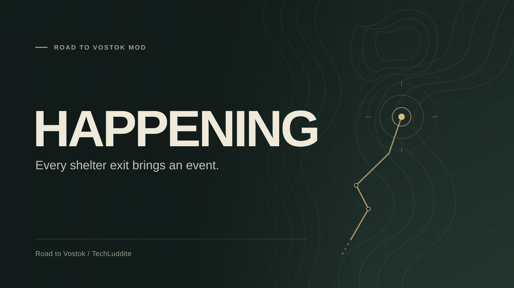

# Happening



Every shelter exit brings an event.

Happening changes Road to Vostok's event scheduling. When you leave a shelter for a game zone, a large on-screen announcement shows the map and the event that has spawned.

Events keep their stock locations. Non-BTR events can happen on any day, weekday, time of day, or reputation level, without their usual probability roll or random delay. Fighter Jets are removed.

## Events

| Event | Location |
| --- | --- |
| Punisher | Area 05 |
| Airdrops | Area 05 |
| Attack Helicopters | Border Zone |
| Helicopter Crash Sites | Game zones with stock crash markers |
| Bogeyman | Area 05, including daytime |
| Driver | Highway |
| Nomad Gatherings | Village, at any reputation |

BTR patrols retain their stock unlocks, spawn probability, and timing. They can accompany the guaranteed event. The announcement names the guaranteed event.

Ordinary zone-to-zone travel keeps stock scheduling, with Fighter Jets disabled. Stationary trader progression, story events, and random enemy or Nomad groups keep their stock behavior. Nomad Gatherings retain their stock encounter setup.

## Requirements

Tested with Road to Vostok **0.2.0.5 (Build 2)** and **Metro Mod Loader 3.4.1**. Game updates can change the event system; check compatibility before updating.

The player confirmed working repeated shelter exits. Automated Godot 4.6.3 checks also cover announcements, scheduling, spawn prerequisites, BTR rules, and Metro hook integration. Other maps and event combinations still need broader gameplay coverage.

## Install

1. Install [Metro Mod Loader](https://github.com/ametrocavich/vostok-mod-loader). Its `modloader.gd` and `override.cfg` go next to `RTV.exe`.
2. Download **Happening.vmz** from [GitHub Releases](https://github.com/TechLuddite/Happening/releases/latest) or Happening's mod-site listing. Use the `.vmz` asset rather than GitHub's source archive.
3. Put `Happening.vmz` in the game's `mods` folder, for example `steamapps/common/Road to Vostok/mods/Happening.vmz`.
4. Launch the game, enable Happening on Metro's Mods tab, and launch modded.
5. Leave a shelter for a game zone. Allow the game's map initialization to finish; Nomad Gatherings need an additional short setup before their announcement.

To turn Happening off, disable it in Metro. The mod keeps its scheduling state in memory and does not write save resources.

The game's Events tab still shows vanilla descriptions and unlock labels for remaining events. Those labels do not describe Happening's scheduling. Mods replacing the same event scheduling methods may conflict; check Metro's hook status if announcements or events fail to appear.

## Build

From this repository:

```sh
python3 -m unittest discover -s tests -p 'test_*.py'
python3 scripts/pack.py
```

The build produces `dist/Happening.vmz` and `dist/Happening.vmz.sha256`. The package contains the manifest, Happening's three runtime scripts, and its license. No game files or external Python packages are needed to build it.

The GitHub workflow validates the package on pull requests and publishes a release on `main` when `mod.txt` names a version without an existing release. See [RELEASING.md](RELEASING.md) for the first publication and mod-site submissions, and [CHANGELOG.md](CHANGELOG.md) for changes.

## License and credits

[MIT](LICENSE). Created by TechLuddite with AI-assisted code and documentation. Uses Metro Mod Loader's hooks and the game's existing event executors. Road to Vostok and Metro are separate projects and are not included in this repository.
